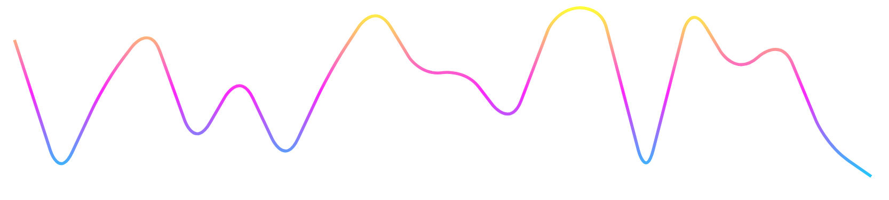

# reactrend

`reactrend` is an R wrapper to [react-trend](https://github.com/unsplash/react-trend) built with [reactR](https://github.com/React-r/reactR).

## Installation

``` r
# install.packages("remotes")
remotes::install_github("JohnCoene/ractrend")
```

## Example

``` r
reactrend(runif(100))
```


